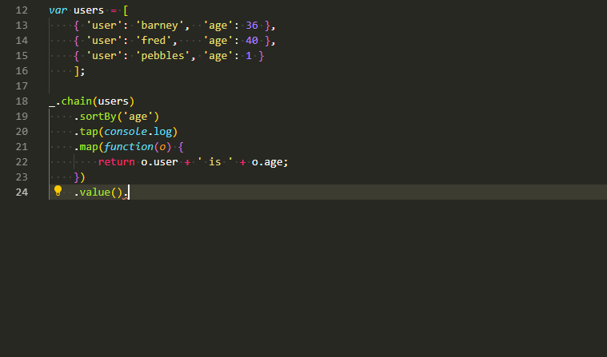
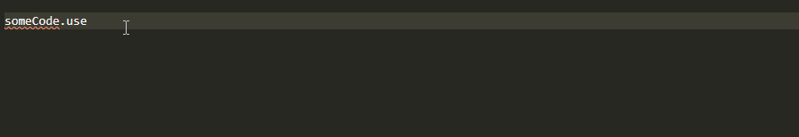
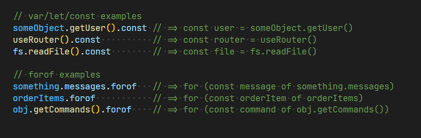

# vscode-postfix-ts

[](https://marketplace.visualstudio.com/items?itemName=ipatalas.vscode-postfix-ts)
[](https://marketplace.visualstudio.com/items?itemName=ipatalas.vscode-postfix-ts)
[](https://codecov.io/gh/ipatalas/vscode-postfix-ts)

[](https://www.buymeacoffee.com/0t1sqOM)

> Postfix templates for TypeScript/JavaScript

## Features

This extension features postfix templates that can be used to improve productivity.
It's been inspired on former, great [R# extension](https://github.com/controlflow/resharper-postfix)

I find it annoying to jump the cursor back and forth whenever I want to perform some simple operations. This extension makes it easier. I use this feature on daily basis in C# but was missing it in JS/TS until now.

A simple animation is worth more than words:


It also works pretty well with multiline expressions (v1.9.0+):



There is also a special handling for `.not` template which allows you to select specific expression to invert when having more options:


All available templates (`expr` means the expression on which the template is applied):

| Template          | Outcome |
| -------:          | ------- |
| **.if**           | `if (expr)` |
| **.else**         | `if (!expr)` |
| **.null**         | `if (expr === null)` |
| **.notnull**      | `if (expr !== null)` |
| **.undefined**    | `if (expr === undefined)` or `if (typeof expr === "undefined")` (see [settings](#Configuration)) |
| **.notundefined** | `if (expr !== undefined)` or `if (typeof expr !== "undefined")` (see [settings](#Configuration))|
| **.for**          | `for (let i = 0; i < expr.Length; i++)` |
| **.forof**        | `for (const item of expr)` |
| **.forin**        | `for (const item in expr)` |
| **.foreach**      | `expr.forEach(item => )` |
| **.not**          | `!expr` |
| **.return**       | `return expr` |
| **.var**          | `var name = expr` |
| **.let**          | `let name = expr` |
| **.const**        | `const name = expr` |
| **.log**          | `console.log(expr)` |
| **.error**        | `console.error(expr)` |
| **.warn**         | `console.warn(expr)` |
| **.cast**         | `(<SomeType>expr)` |
| **.castas**       | `(expr as SomeType)` |
| **.call**         | `{cursor}(expr)` |
| **.new**          | `new expr()` |
| **.promisify**    | `Promise<expr>` |
| **.await**        | `await expr` |

If for any reason you don't like either of those templates you can disable them one by one using `postfix.disabledBuiltinTemplates` setting.

## Custom templates (1.6.0 and above)

You can now add your own templates if the defaults are not enough. This will only work for simple ones as some templates require additional tricky handling.
To configure a template you need to set `postfix.customTemplates` setting. It's an array of the following objects:

```JSON
{
  "name": "...",
  "description": "...",
  "body": "...",
  "when": ["..."]
}
```

`name` defines what will be the name of the suggestion
`description` will show additional optional description when suggestion panel is opened
`body` defines how the template will work (see below)
`when` defines conditions when the template should be suggested

### Template body

Template body defines how will the expression before the cursor be replaced. Body can be defined either as single string or array of strings. If it's an array then strings will be joined with a newline character.
It supports standard Visual Studio Code [Snippet syntax](https://code.visualstudio.com/docs/editor/userdefinedsnippets#_snippet-syntax).
There is also one special placeholder that can be used:

- `{{expr}}`: this will be replaced by the expression on which the template is applied so for example `!{{expr}}` will simply negate the expression
- this placeholder can have modifiers (`upper`, `lower`, `capitalize`) which can be used in the following way:
```JSON
{
    "name": "useState",
    "body": "const [{{expr}}, set{{expr:capitalize}}] = React.useState();",
    "description": "const [{{expr}}, set{{expr:capitalize}}] = React.useState();",
    "when": []
}
```

This snippet will have the following outcome (name of the original identifier has been capitalized):


### Template conditions

`when` condition can be zero or more of the following options:

- `identifier`: simple identifier, ie. `variableName` (inside an if statement or function call arguments)
- `expression`: can be either a simple expression like `object.property.value` or `array[index]` or a combination of them
- `binary-expression`: a binary expression, ie. `x > 3`, `x * 100`, `x && y`
- `unary-expression`: an unary expression, ie. `!x`, `x++` or `++x`
- `new-expression`: a new expression, ie. `new Type(arg1, arg2)`
- `function-call`: a function call expression, ie. `func()`, `object.method()` and so on
- `type`: type in function/variable definition, ie. `const x: string`
- `string-literal`: string literal, ie. `'a string'` or `"string in double quotes"`

If no conditions are specified then given template will be available under all possible situations

## Infer variable names (1.11.0 and above)

For `var`/`let`/`const` and `forof`/`foreach` templates the extension will try to infer a better name for the variable based on the subject expression.
For instance `fs.readFile()` expression will result in variable named `file` instead of default `name`. Same applies to `forof`/`foreach` templates, but in this case the extension is trying to figure out a singular form of the subject. Of course this can still be easily changed, it's only a suggestion.
Few examples on the image below:



If you have ideas for more "patterns" that could be easily handled please create an issue.

## Configuration

This plugin contributes the following [settings](https://code.visualstudio.com/docs/customization/userandworkspace):

- `postfix.languages`: array of [language identifiers](https://code.visualstudio.com/docs/languages/identifiers) in which the extension will be available. Default value is  **['javascript', 'typescript', 'javascriptreact', 'typescriptreact']**
- `postfix.customTemplates`: array of custom template definitions - see [Custom templates (1.6.0 and above)](#custom-templates-160-and-above)
- `postfix.customTemplates.mergeMode`: determines how custom templates are shown if they share the same name with built-in template:
  - `append` - both built-in and custom template will be shown
  - `override` - only custom template will be shown (it overrides built-in one)
- `postfix.undefinedMode`: determines the behavior of `.undefined` and `.notundefined` templates, either equality comparison or typeof
- `postfix.inferVariableName`: enables variable name inferring
- `postfix.disabledBuiltinTemplates`: allows to disable particular built-in templates (for instance discouraged `var`)

The `postfix.languages` setting can be used to make the extension available for inline JS/TS which is in other files like **.html**, **.vue** or others. You must still include `javascript` and `typescript` if you want the extension to be available there among the others.

## Known issues

Feel free to open issues for whatever you think may improve the extension's value. New ideas for more templates are also welcome. Most of them are pretty easy to implement.
