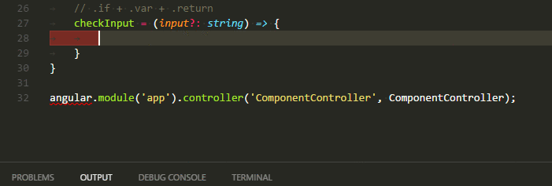
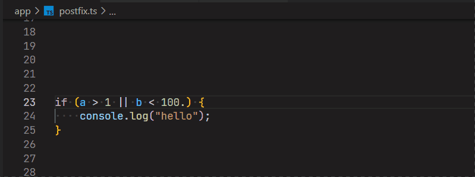

[](https://travis-ci.org/ipatalas/vscode-postfix-ts)
[](https://www.bithound.io/github/ipatalas/vscode-postfix-ts/master/dependencies/npm)
[](https://www.bithound.io/github/ipatalas/vscode-postfix-ts)
[](https://codecov.io/gh/ipatalas/vscode-postfix-ts)

# Postfix templates for TypeScript/JavaScript

## Features

This extension features postfix templates that can be used to improve productivity.
It's been inspired on former, great [R# extension](https://github.com/controlflow/resharper-postfix)

I find it annoying to jump the cursor back and forth whenever I want to perform some simple operations. This extension makes it easier. I use this feature on daily basis in C# but was missing it in JS/TS until now.

A simple animation is worth more than words:



There is also a special handling for `.not` template which allows you to select specific expression to negate when having more options:



All available templates (`expr` means the expression on which the template is applied):

| Template          | Outcome |
| -------:          | ------- |
| **.if**           | `if (expr)` |
| **.else**         | `if (!expr)` |
| **.null**         | `if (expr === null)` |
| **.notnull**      | `if (expr !== null)` |
| **.undefined**    | `if (expr === undefined)` |
| **.notundefined** | `if (expr !== undefined)` |
| **.for**          | `for (let i = 0; i < expr.Length; i++)` |
| **.forof**        | `for (let item of expr)` |
| **.foreach**      | `expr.forEach(item => )` |
| **.not**          | `!expr` |
| **.return**       | `return expr` |
| **.var**          | `var name = expr` |
| **.let**          | `let name = expr` |
| **.const**        | `const name = expr` |
| **.log**          | `console.log(expr)` |
| **.error**        | `console.error(expr)` |
| **.warn**         | `console.warn(expr)` |
| **.cast**         | `(<SomeType>expr)` |
| **.castas**         | `(expr as SomeType)` |

## Custom templates (1.6.0 and above)

You can now add your own templates if the defaults are not enough. This will only work for simple ones as some templates require additional tricky handling.
To configure a template you need to set `postfix.customTemplates` setting. It's an array of the following objects:

```JSON
{
  "name": "...",
  "description": "...",
  "body": "...",
  "when": ["..."]
}
```

`name` defines what will be the name of the suggestion  
`description` will show additional optional description when suggestion panel is opened  
`body` defines how the template will work (see below)  
`when` defines conditions when the template should be suggested  

### Template body

Template body defines how will the expression before the cursor be replaced.  
It supports standard Visual Studio Code [Snippet syntax](https://code.visualstudio.com/docs/editor/userdefinedsnippets#_snippet-syntax).
There is also one special placeholder that can be used:

- `{{expr}}`: this will be replaced by the expression on which the template is applied so for example `!{{expr}}` will simply negate the expression  

### Template conditions

`when` condition can be zero or more of the following options:

- `identifier`: simple identifier, ie. `variableName` (inside an if statement or function call arguments)
- `expression`: can be either a simple expression like `object.property.value` or `array[index]` or a combination of them
- `binary-expression`: a binary expression, ie. `x > 3`, `x * 100`, `x && y`
- `unary-expression`: an unary expression, ie. `!x`, `x++` or `++x`
- `function-call`: a function call expression, ie. `func()`, `object.method()` and so on

If no conditions are specified then given template will be available under all possible situations

## Configuration

This plugin contributes the following [settings](https://code.visualstudio.com/docs/customization/userandworkspace):

- `postfix.languages`: array of [language identifiers](https://code.visualstudio.com/docs/languages/identifiers) in which the extension will be available. Default value is  **['javascript', 'typescript']**
- `postfix.customTemplates`: array of custom template definitions - see [Custom templates (1.6.0 and above)](#custom-templates-160-and-above)

The `postfix.languages` setting can be used to make the extension available for inline JS/TS which is in other files like **.html**, **.vue** or others. You must still include `javascript` and `typescript` if you want the extension to be available there among the others.

## Known issues

It's a first release so there is not much validation in the extension. Sometimes it's possible that a specific template does not make much sense in some situations where it's suggested.

Feel free to open issues for whatever you think may improve the extension's value. New ideas for more templates are also welcome. Most of them are pretty easy to implement.
